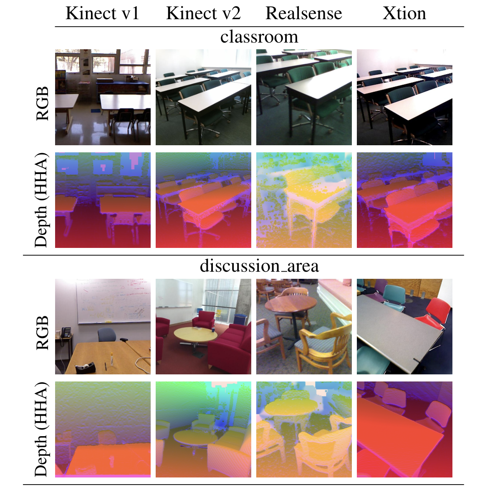

# Multi-Modal RGB-D Scene Recognition Across Domains

We introduce a benchmark testbed for a novel unsupervised domain adaptation problem. We revisited the [SUNRGB-D](https://openaccess.thecvf.com/content_CVPR_2019/papers/Du_Translate-to-Recognize_Networks_for_RGB-D_Scene_Recognition_CVPR_2019_paper.pdf) dataset, identifying a subset of scene classes shared among four different 3D cameras with different acquisition properties. Each camera is considered as an RGB-D domain.

**Setup**

1. Download the complete SUNRGB-D dataset from this [link](https://github.com/ownstyledu/Translate-to-Recognize-Networks).
2. Use the txt file in the "subsets" folder.

