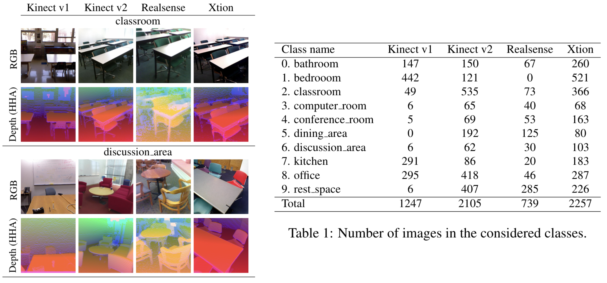

# Multi-Modal RGB-D Scene Recognition Across Domains

PyTorch official implementation of "[Multi-Modal RGB-D Scene Recognition Across Domains](https://arxiv.org/abs/2103.14672)" in Workshop on Multi-Task Learning in Computer Vision (DeepMTL), ICCV 2021.


We introduce a benchmark testbed for a novel unsupervised domain adaptation problem. We revisited the [SUNRGB-D](https://openaccess.thecvf.com/content_CVPR_2019/papers/Du_Translate-to-Recognize_Networks_for_RGB-D_Scene_Recognition_CVPR_2019_paper.pdf) dataset, identifying a subset of scene classes shared among four different 3D cameras with different acquisition properties. Each camera is considered as an RGB-D domain.

**Setup**

1. Download the complete SUNRGB-D dataset from this [link](https://github.com/ownstyledu/Translate-to-Recognize-Networks).
2. Use the proposed txt files in the "subsets" folder.



3. To run the model, execute the following code: ``` python train.py ```
    * Configs DATA\_DIR\_TRAIN, DATA\_DIR\_TRAIN\_2 and DATA\_DIR\_VAL must be changed according to the domains
    * With Realsense, FILTER\_BEDROOM must be set to True and NUM\_CLASSES to 9

**Requirements**

* Cuda 10.1
* Python 3.7.7
* Torch 1.0.0
* Torchvision 0.2.1
* Other Python Requirements in requirements.txt

**Acknowledgement**

Code in this repository has been written starting from [Translate-to-Recognize](https://github.com/ownstyledu/Translate-to-Recognize-Networks)

**Citation**

To cite, please use the following reference:

```
@inproceedings{FerreriBucciTommasi2021,
  title={Multi-Modal RGB-D Scene Recognition Across Domains},
  author={Andrea Ferreri, Silvia Bucci, Tatiana Tommasi},
  booktitle={Proceedings of the IEEE/CVF International Conference on Computer Vision (ICCV) Workshops},
  year={2021}
} 
```

